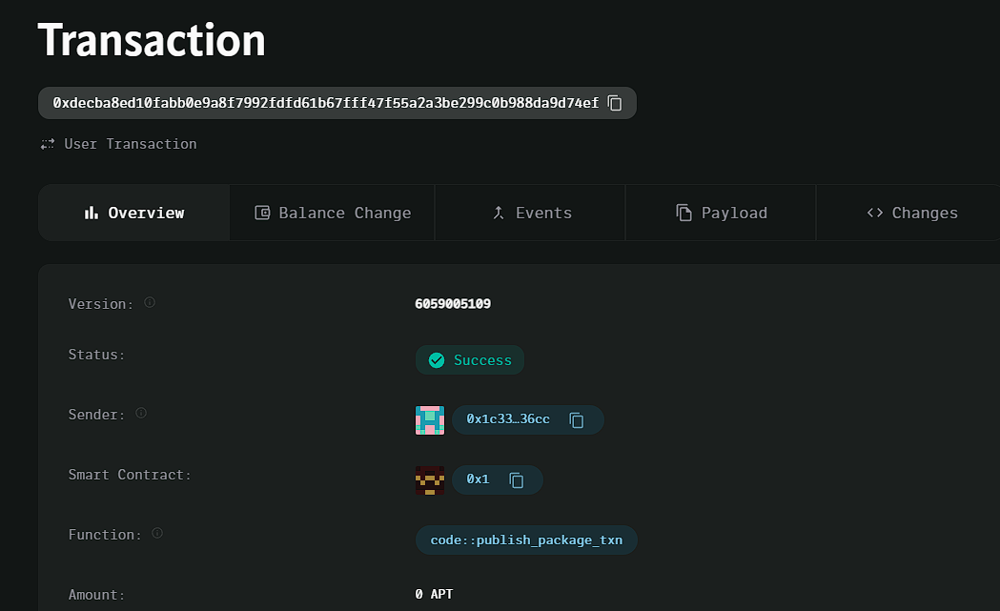

### Deployed smartcontract address: 0xdecba8ed10fabb0e9a8f7992fdfd61b67fff47f55a2a3be299c0b988da9d74ef

### Screenshot: 

# Basic Decentralized Exchange (DEX)

## Project Title
Basic Decentralized Exchange (DEX)

## Project Description
A simple decentralized exchange (DEX) that allows users to swap between two cryptocurrencies: AptosCoin and TokenB. Users can add liquidity to the pool, and other users can swap one cryptocurrency for the other based on the pool's reserves.

## Vision
To provide a minimalistic decentralized exchange platform that allows users to trade between two tokens using a basic liquidity pool mechanism. This DEX serves as a starting point for more advanced features in future versions.

## Key Features
- **Liquidity Pool**: Users can add liquidity to the pool by providing AptosCoin and TokenB.
- **Token Swap**: Users can swap AptosCoin for TokenB, with the amount of tokens received based on the current reserves in the liquidity pool.
- **Simple Reserve Logic**: The swap function uses the ratio of reserves to determine the output of the token being swapped.

## Future Scope
- Implement actual token transfers for TokenB.
- Allow users to remove liquidity from the pool.
- Add a more sophisticated price calculation mechanism (e.g., using a constant product formula like Uniswap).
- Introduce more than two token swaps and multi-token liquidity pools.
- Create a user interface to interact with the DEX.

